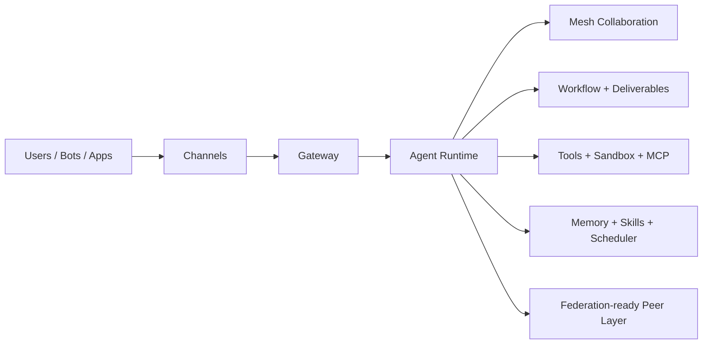

# AgentFlyer

[](https://www.npmjs.com/package/agentflyer)
[](https://bun.sh)
[](https://nodejs.org)
[](LICENSE)

<div align="center">

### Run agents like a runtime system, not a pile of scripts.

**Agent mesh · Workflow runtime · Deliverables · MCP · Sandbox · Multi-channel control plane**

</div>

Distributed AgentOS for multi-agent orchestration, workflows, memory, deliverables, and operator-facing AI runtimes.

[中文说明](README_CN.md)

AgentFlyer is for teams and builders who want more than a chat wrapper. It brings agent execution, workflow coordination, memory retrieval, tool access, operator control, and multi-channel delivery into one runtime that already works on a single machine and is being shaped toward cross-host collaboration.

## One-line Positioning

AgentFlyer is an operator-first AgentOS runtime for teams who have outgrown single-chat agent demos and need durable workflows, controllable tooling, and multi-channel delivery in one system.

## 3 Core Scenarios

- **Team AgentOS**: Run coordinator + specialist agents in one runtime with shared state and operational visibility.
- **Workflow Operations**: Convert repeat work into inspectable workflow runs with scheduler triggers, approvals, and deliverables.
- **Controlled Tool Execution**: Integrate external tools via MCP and sandbox profiles instead of giving unbounded host access.

## What It Is

AgentFlyer is aiming at a practical AgentOS shape:

- Multiple agents can coexist inside one runtime, discover each other, delegate work, and coordinate through mesh-style collaboration.
- Operators get a real control surface instead of a hidden prompt chain: Console UI, CLI, approvals, sessions, scheduler, workflows, and deliverables are already part of the system.
- Outputs are treated as stateful assets, not disposable chat bubbles: sessions, memories, deliverables, and artifacts all have explicit places in the runtime.
- Tool execution has clearer boundaries through approval policies, MCP integration, and Docker-backed sandbox profiles.
- Federation is part of the architecture now, but still an actively evolving layer rather than a finished multi-host product story.

## Current Progress

The project is no longer just a concept repo. The main system surfaces already exist in the codebase today:

| Area | Current state |
|---|---|
| Runtime | Multi-model agent runtime, tool-call loop, resumable session state, context compaction, usage stats |
| Control plane | Console UI, CLI, approvals, config, sessions, inbox-style operator views, metrics |
| Orchestration | Workflow runtime, super-node patterns, scheduler, execution history, deliverables |
| Tooling | MCP registry and transport layer, approval-aware tool exposure, Docker sandbox runtime |
| Channels | Web, CLI, Telegram, Discord, Feishu, and QQ entry points |
| Federation | Node, peer, discovery, transport, and memory-sync foundations are present, but still expanding |

That matters because AgentFlyer is already useful as a local or single-host operator runtime, while the federation story is being built on top of real running surfaces instead of empty architecture slides.

## Core Capabilities

### Runtime

- Unified model registry for Anthropic, OpenAI, Google-compatible, Ollama, and OpenAI-compatible providers.
- Agent execution engine with queueing, tool-call loops, failover paths, and context compaction.
- JSONL-backed sessions and resumable runtime state.
- Skill injection based on SKILL.md.
- Hybrid memory built around SQLite, BM25 search, and vector embeddings.
- Token usage and runtime metrics tracking.

### Control Plane

- Built-in Console UI with overview, agents, chat, inbox, sessions, config, memory, scheduler, workflows, deliverables, federation, and operator guidance surfaces.
- Full CLI for gateway lifecycle, chat, messaging, config, skills, memory, stats, and session workflows.
- Intent-aware routing and per-agent approval policy.
- Deliverable tracking so workflow outputs and chat artifacts remain visible and publishable.

### Orchestration

- Workflow runtime with agent steps, conditions, transforms, branching, and execution history.
- Super-node workflow patterns for higher-order coordination such as collection, debate, decision, review, and adjudication.
- Cron-based scheduler for tasks and workflow-triggered runs.

### Tooling And Execution

- MCP registry with server config, prefixed tools, runtime status, reconnect handling, and approval integration.
- Docker-backed sandbox runtime with execution profiles, mount policy, diagnostics, and artifact mirroring.

### Channels

- Web channel with WebSocket, SSE streaming chat, and OpenAI-compatible chat surface.
- Telegram, Discord, Feishu, and QQ adapters.
- CLI chat path for local operator workflows.

## Architecture

### Full Runtime View

```text
+-------------------------------------------------------------+
|                    AgentFlyer Instance                      |
|                                                             |
|  +----------+  +----------+  +----------+  +-----------+   |
|  | Telegram |  |  Feishu  |  | Discord  |  |  Console  |   |
|  | Channel  |  | Channel  |  | Channel  |  |    UI     |   |
|  +----+-----+  +----+-----+  +----+-----+  +-----+-----+   |
|       +---------------+---------------+-----------+         |
|                           |                                 |
|  +------------------------v-------------------------------+ |
|  |              Message Router / Session Key              | |
|  +------------------------+-------------------------------+ |
|                           |                                 |
|  +------------------------v-------------------------------+ |
|  |                 Mesh Bus (in-memory)                   | |
|  |                                                        | |
|  |   +----------+  +----------+  +--------------------+   | |
|  |   |  main    |<->| worker  |  |     specialist     |   | |
|  |   | (coord.) |  | (worker) |  |   (domain expert)  |   | |
|  |   +----+-----+  +----------+  +--------------------+   | |
|  +--------+-----------------------------------------------+ |
|           |                                                  |
|  +--------v------------------------------------------------+ |
|  |         Core Services                                   | |
|  |  Memory(SQLite+Vec) | Skills | Scheduler | Config       | |
|  +---------------------+--------+-----------+--------------+ |
|                                                             |
|  +---------------------------------------------------------+ |
|  |   Sandbox + MCP + Deliverables + Workflow Runtime       | |
|  +---------------------------------------------------------+ |
|                                                             |
|  +---------------------------------------------------------+ |
|  |   Federation Layer (expanding)                          | |
|  |  Identity | Peer Registry | Transport | Discovery       | |
|  +----------------------------+----------------------------+ |
+-------------------------------+-----------------------------+
                                | Cross-host collaboration
                +---------------+----------------+
                v                                v
        [Other AgentFlyer Instance]     [Other AgentFlyer Instance]
```

### Layer Map

```text
Channels -> Gateway -> Agent Runtime -> Skills / Memory / Tools / Scheduler
                      |
                      +-> Mesh collaboration
                      +-> Workflow and deliverables
                      +-> Sandbox and MCP
                      +-> Federation-ready peer layer
```

### Mermaid View



The codebase is structured as a layered runtime rather than a monolithic chat app:

- core: config, types, session, logger, crypto, runtime compatibility
- skills and memory: reusable lower-level services
- agent: prompt building, runners, compaction, tools, model calls
- mesh: in-process collaboration bus and registry
- gateway: HTTP, RPC, Console UI, workflow backend, deliverables, control plane
- sandbox and mcp: controlled execution and external tool ecosystem
- federation: peer identity, discovery, transport, and cross-host seams

## Quick Start

### Install From npm

```bash
npm install -g agentflyer
agentflyer start
```

Then open:

- Console UI: http://localhost:19789
- CLI chat: `agentflyer chat`

On first run, AgentFlyer creates runtime data under `~/.agentflyer/`.

### Minimal Config Example

```jsonc
{
  "gateway": {
    "port": 19789,
    "auth": { "mode": "token", "token": "change-me" }
  },
  "models": {
    "main": {
      "provider": "openai-compat",
      "apiBaseUrl": "https://api.openai.com/v1",
      "apiKey": "sk-...",
      "models": {
        "chat": { "id": "gpt-4.1", "maxTokens": 8192 }
      }
    }
  },
  "defaults": {
    "model": "main/chat"
  },
  "agents": [
    {
      "id": "main",
      "name": "Main Agent",
      "skills": ["base"],
      "mesh": {
        "role": "coordinator",
        "capabilities": ["general"],
        "visibility": "public"
      }
    }
  ],
  "channels": {
    "web": { "enabled": true },
    "cli": { "enabled": true }
  }
}
```

### Run From Source

Requirements:

- Bun >= 1.2 recommended
- Node.js >= 22 supported
- pnpm >= 9

```bash
git clone https://github.com/tddt/AgentFlyer.git
cd AgentFlyer
pnpm install
pnpm build
pnpm start
```

Development commands:

```bash
pnpm dev:start
pnpm dev:chat
pnpm typecheck
pnpm check
pnpm test
```

## 5-Minute Quick Start

1. Install and boot:
   - `npm install -g agentflyer`
   - `agentflyer start`
2. Open Console UI: `http://localhost:19789`
3. Open CLI chat: `agentflyer chat`
4. Configure one model and one agent in `~/.agentflyer/config.json`
5. Run one chat and one workflow to validate your local operator loop

## FAQ (Fast Answers)

- **Is it usable now?** Yes for local/single-host operations.
- **Is federation complete?** No, federation is actively expanding.
- **Who is it for?** Teams that need sessions, approvals, workflows, deliverables, and multi-channel runtime operations.
- **Who should use a smaller stack?** Single-assistant or disposable chat-only use cases.

## Where It Fits Best

- Run a personal or team AgentOS with multiple specialist agents in one runtime.
- Expose the same runtime through Web, CLI, Telegram, Discord, Feishu, or QQ.
- Build operator-facing workflows for collection, debate, review, and publishable outputs.
- Connect external tools through MCP instead of accumulating one-off integrations.
- Use sandbox profiles and approvals to keep execution boundaries tighter than raw host access.
- Grow toward cross-host collaboration as federation capabilities mature.

## Why The Repo Is Interesting

- It targets a bigger category than a single chat app.
- It already has real operator surfaces, not just prompt demos.
- It combines runtime, workflow, memory, tooling, and delivery in one system.
- It is opinionated enough to operate today and open enough to extend.

## Project Status

AgentFlyer is already usable as a local or single-host AgentOS.

Today:

- Core runtime, Console UI, workflow backend, scheduler, memory, channels, CLI, and deliverables are implemented and in active use.
- MCP and sandbox are implemented and still being refined at the runtime and operator-experience level.
- Federation already has architectural seams and early modules in the tree, but practical multi-host operations are still an expansion area.
- The decentralized economy model remains directional, not a finished product feature.

## Contributing

The project uses strict TypeScript, ESM, Bun-first compatibility, and explicit dependency boundaries between layers.

Start here:

- [AGENTS.md](AGENTS.md)
- [package.json](package.json)

Core checks:

```bash
pnpm typecheck
pnpm check
pnpm test
```

## Launch and Growth Assets

- [30-Day Launch Playbook](docs/growth/launch-playbook.md)
- [Intro Post Template](docs/growth/intro-post-template.md)
- [Channel Post Templates](docs/growth/channel-post-templates.md)
- [Analytics Baseline](docs/growth/analytics-baseline.md)
- [Weekly Retro Template](docs/growth/weekly-retro-template.md)

## Roadmap Direction

- turn federation foundations into practical multi-host workflows
- improve MCP transport, reliability, and server lifecycle management
- keep tightening sandbox policy and safer execution defaults
- deepen workflow super-node patterns and deliverable-driven operator flows
- continue reducing token overhead while improving coordination quality

## License

MIT
