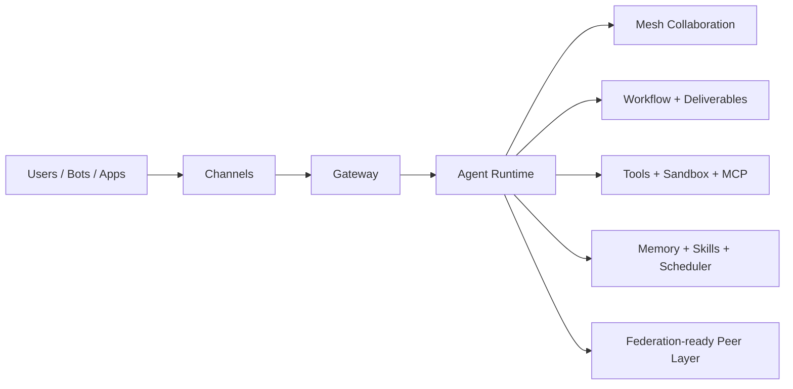

# AgentFlyer

[](https://www.npmjs.com/package/agentflyer)
[](https://bun.sh)
[](https://nodejs.org)
[](LICENSE)

<div align="center">

### 让 Agent 像系统一样运行，而不是像脚本一样堆叠。

**Agent Mesh · Workflow Runtime · Deliverables · MCP · Sandbox · Multi-channel Control Plane**

</div>

去中心化 AgentOS，用来运行多 Agent、多通道、可持续扩展的 AI 运行时系统。

[English version](README.md)

AgentFlyer 面向的不是“再做一个聊天机器人”，而是一套真正可运营、可编排、可观测、可扩展的 Agent 系统：把 Agent 协作、工作流执行、记忆检索、产出物追踪、受控执行、MCP 工具接入、多通道交付和控制平面统一在一个 runtime 内。

如果你希望 AI Agent 像一个系统而不是像一个脚本那样工作，AgentFlyer 的目标就是给出这个系统的雏形。

## 这不是普通 Agent 项目

AgentFlyer 的产品取向很明确：

- Mesh 原生协作：agent 之间可以在同一实例内发现彼此、委托任务、分工协作。
- 面向操作者：Console UI、审批、会话恢复、Scheduler、Workflow Designer、Deliverables 都是产品的一部分。
- 记忆和产出物是一等公民：结果不会只停留在对话气泡里，而会沉淀为 session、memory、deliverable、artifact。
- 执行边界更清晰：sandbox profile 和工具审批策略比直接把宿主机权限暴露给所有 agent 更可控。
- 天然支持向联邦演进：Peer、Identity、Transport、Discovery 都已被纳入架构边界。

## 为什么它有传播力

- 它不是单机聊天壳子。
- 它不是 prompt 包装器。
- 它不是把 workflow、memory、UI、tools 临时缝在一起的脚手架。
- 它更像一个正在成形的 Agent Operating System。

如果 GitHub 上真正稀缺的是“系统级 Agent 项目”，那么 AgentFlyer 就在这个位置上。

## 一眼看懂

| 层 | 你能得到什么 |
|---|---|
| 协作 | Mesh 原生 agent，可发现、委托、协同 |
| 编排 | Workflow、Scheduler、Super Nodes、执行历史 |
| 状态 | Sessions、Hybrid Memory、Deliverables、Artifacts |
| 安全 | 工具审批策略、Sandbox Profile、受控执行 |
| 运维 | Console UI、CLI、路由、统计、多通道入口 |
| 扩展 | 今天可接 MCP，未来可继续向 Federation 演进 |

## 核心能力

### Runtime

- 统一模型注册表，支持 Anthropic、OpenAI、Google 兼容、Ollama、OpenAI-compatible 提供商。
- Agent 执行引擎，包含工具调用回环、队列、故障切换、上下文压缩。
- JSONL 会话持久化和可恢复运行状态。
- 基于 SKILL.md 的技能系统，按需注入 Prompt。
- SQLite + BM25 + 向量嵌入的混合记忆系统。
- Token 用量统计和运行态指标。

### 控制平面

- 内置 Console UI，可管理总览、Agents、Chat、Inbox、Sessions、Config、Memory、Scheduler、Workflow、Deliverables、Federation、内置使用指引。
- 完整 CLI，覆盖网关生命周期、发消息、配置、技能、记忆、统计、会话管理。
- 意图路由和 agent 级工具审批策略。
- Deliverable 追踪，把工作流结果和聊天回合产物提升为一等对象。

### 编排能力

- Workflow 引擎，支持 agent step、condition、transform、branching 和执行历史。
- Super Node 工作流，用于多源采集、对抗辩论、决策生成、风险审核、裁定等高阶协作模式。
- 基于 cron 的 Scheduler，可触发任务和工作流运行。

### 工具与执行

- MCP 注册中心，支持 server 配置、工具前缀、运行态状态、刷新路径、approval 集成。
- 基于 Docker 的 Sandbox runtime，支持 profile、挂载策略、诊断和产物镜像。

### 接入渠道

- Web 通道，包含 WebSocket、SSE 流式聊天，以及 OpenAI-compatible chat 接口表面。
- Telegram、Discord、飞书、QQ 适配器。

## 架构图

### 完整运行时视图

```text
+-------------------------------------------------------------+
|                    AgentFlyer Instance                      |
|                                                             |
|  +----------+  +----------+  +----------+  +-----------+   |
|  | Telegram |  |  Feishu  |  | Discord  |  |  Console  |   |
|  | Channel  |  | Channel  |  | Channel  |  |    UI     |   |
|  +----+-----+  +----+-----+  +----+-----+  +-----+-----+   |
|       +---------------+---------------+-----------+         |
|                           |                                 |
|  +------------------------v-------------------------------+ |
|  |              Message Router / Session Key              | |
|  +------------------------+-------------------------------+ |
|                           |                                 |
|  +------------------------v-------------------------------+ |
|  |                 Mesh Bus (in-memory)                   | |
|  |                                                        | |
|  |   +----------+  +----------+  +--------------------+   | |
|  |   |  main    |<->| worker  |  |     specialist     |   | |
|  |   | (coord.) |  | (worker) |  |   (domain expert)  |   | |
|  |   +----+-----+  +----------+  +--------------------+   | |
|  +--------+-----------------------------------------------+ |
|           |                                                  |
|  +--------v------------------------------------------------+ |
|  |         Core Services                                   | |
|  |  Memory(SQLite+Vec) | Skills | Scheduler | Config       | |
|  +---------------------+--------+-----------+--------------+ |
|                                                             |
|  +---------------------------------------------------------+ |
|  |   Sandbox + MCP + Deliverables + Workflow Runtime       | |
|  +---------------------------------------------------------+ |
|                                                             |
|  +---------------------------------------------------------+ |
|  |   Federation Layer (expanding)                          | |
|  |  Identity | Peer Registry | Transport | Discovery       | |
|  +----------------------------+----------------------------+ |
+-------------------------------+-----------------------------+
                                | 跨主机协作
                +---------------+----------------+
                v                                v
        [Other AgentFlyer Instance]     [Other AgentFlyer Instance]
```

### 分层视图

```text
Channels -> Gateway -> Agent Runtime -> Skills / Memory / Tools / Scheduler
                      |
                      +-> Mesh collaboration
                      +-> Workflow and deliverables
                      +-> Sandbox and MCP
                      +-> Federation-ready peer layer
```

### Mermaid 视图



它是一个分层系统，而不是单体聊天应用：

- core：配置、类型、会话、日志、加密、运行时兼容
- skills 和 memory：底层可复用服务
- agent：Prompt 构建、runner、压缩、工具、LLM 调用
- mesh：实例内协作总线和注册表
- gateway：HTTP、RPC、Console UI、workflow backend、deliverables、控制平面
- sandbox 和 mcp：受控执行与外部工具生态
- federation：跨主机协作所需的身份和传输层 seam

## 快速开始

### 从 npm 安装

```bash
npm install -g agentflyer
agentflyer start
```

然后打开：

- Console UI: http://localhost:19789
- CLI 对话：`agentflyer chat`

首次运行时，AgentFlyer 会在 `~/.agentflyer/` 下创建运行时数据目录。

### 最小配置示例

```jsonc
{
  "gateway": {
    "port": 19789,
    "auth": { "mode": "token", "token": "change-me" }
  },
  "models": {
    "main": {
      "provider": "openai-compat",
      "apiBaseUrl": "https://api.openai.com/v1",
      "apiKey": "sk-...",
      "models": {
        "chat": { "id": "gpt-4.1", "maxTokens": 8192 }
      }
    }
  },
  "defaults": {
    "model": "main/chat"
  },
  "agents": [
    {
      "id": "main",
      "name": "Main Agent",
      "skills": ["base"],
      "mesh": {
        "role": "coordinator",
        "capabilities": ["general"],
        "visibility": "public"
      }
    }
  ],
  "channels": {
    "web": { "enabled": true },
    "cli": { "enabled": true }
  }
}
```

### 从源码运行

要求：

- 推荐 Bun >= 1.2
- 支持 Node.js >= 22
- pnpm >= 9

```bash
git clone https://github.com/tddt/AgentFlyer.git
cd AgentFlyer
pnpm install
pnpm build
pnpm start
```

开发常用命令：

```bash
pnpm dev:start
pnpm dev:chat
pnpm typecheck
pnpm check
pnpm test
```

## 适合用来做什么

- 搭建个人或团队级的 AgentOS，运行多个专业分工 agent。
- 把 Web、Telegram、Discord、飞书、QQ 等入口接到同一套 runtime。
- 构建操作者导向的工作流，完成信息采集、方案辩论、风险审核和产出发布。
- 通过 MCP 接入外部工具，而不是不断堆积一次性的自定义集成。
- 用 sandbox profile 执行受限命令，而不是默认把宿主机权限完全暴露给 agent。
- 为跨主机协作做准备，让不同机器上的 agent、记忆和算力逐步联动起来。

## 为什么开发者会愿意 Star 这种项目

- 它瞄准的是比“AI 聊天应用”更大的类别。
- 它已经有真实的系统表面：UI、CLI、Workflow、Sessions、Routing、Channels。
- 它足够像产品，不是只有 demo；同时又保留了很强的扩展空间。
- 它把 agent、memory、workflow、tools、delivery 放进了一张很容易理解的系统图里。

## 项目状态

AgentFlyer 现在已经可以作为本地或单主机 AgentOS 使用。

当前状态：

- 核心 runtime、Console UI、workflow、scheduler、memory、channels、CLI、deliverables 已经落地并可用。
- Sandbox 和 MCP 已落地，但仍在快速打磨。
- Federation 已进入架构和配置层，实用化的多主机能力仍在继续扩展。
- 去中心化经济模型是方向，不是已完成的生产特性。

## 参与贡献

仓库采用 strict TypeScript、ESM、Bun-first 兼容策略，以及明确的分层依赖边界。

建议先看：

- [AGENTS.md](AGENTS.md)
- [package.json](package.json)

基础检查：

```bash
pnpm typecheck
pnpm check
pnpm test
```

## 路线方向

- 把 federation 从架构基础推进到真正可用的多主机场景
- 继续完善 MCP transport 和 server 生命周期管理
- 深化 sandbox 策略与默认安全执行体验
- 持续强化 workflow super nodes 和 deliverable 驱动的操作流
- 在提升协作质量的同时继续降低 token 开销

## License

MIT
