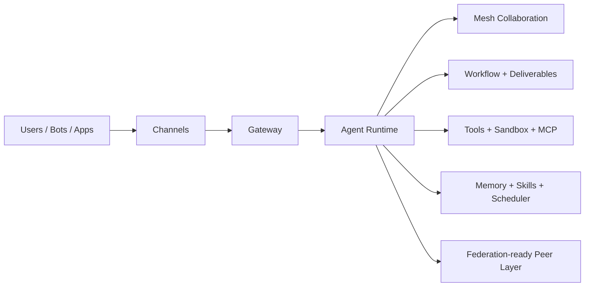

# AgentFlyer

[](https://www.npmjs.com/package/agentflyer)
[](https://bun.sh)
[](https://nodejs.org)
[](LICENSE)

<div align="center">

### 让 Agent 像运行时系统一样工作，而不是堆成一摞脚本。

**Agent Mesh · Workflow Runtime · Deliverables · MCP · Sandbox · Multi-channel Control Plane**

</div>

去中心化 AgentOS，用来承载多 Agent 协作、工作流执行、记忆检索、产出物追踪和多通道运营控制。

[English version](README.md)

AgentFlyer 面向的是希望把 Agent 当作系统来运营的人，而不是只想再套一层聊天界面的使用者。它把 Agent 执行、工作流编排、记忆检索、工具接入、操作者控制面和多通道交付统一到一个 runtime 里，并且已经能在单机或单主机场景中实际运行，后续再继续向多主机协作演进。

## 它是什么

AgentFlyer 正在形成一个更接近实用 AgentOS 的形态：

- 多个 agent 可以在同一个 runtime 内共存、互相发现、委托任务，并通过 mesh 方式协作。
- 操作者拿到的不是隐藏起来的 prompt 链，而是真正的控制面：Console UI、CLI、审批、会话、Scheduler、Workflow、Deliverables 都已经是系统的一部分。
- 输出结果不是一次性对话气泡，而是会沉淀成 session、memory、deliverable 和 artifact 的持久状态。
- 工具执行边界更清晰，审批策略、MCP 集成和 Docker sandbox profile 共同限制执行范围。
- Federation 已经进入架构和模块边界，但仍属于持续扩展中的能力层，而不是已经完成的多主机产品故事。

## 当前进度

这个项目已经不只是概念仓库，主系统表面已经真实落到代码里：

| 模块 | 当前状态 |
|---|---|
| Runtime | 多模型 agent runtime、工具调用回环、可恢复会话状态、上下文压缩、用量统计 |
| 控制平面 | Console UI、CLI、审批、配置、Sessions、Inbox 风格视图、运行指标 |
| 编排 | Workflow runtime、Super Node 模式、Scheduler、执行历史、Deliverables |
| 工具执行 | MCP 注册与传输层、审批感知的工具暴露、Docker sandbox runtime |
| 通道 | Web、CLI、Telegram、Discord、飞书、QQ |
| Federation | node、peer、discovery、transport、memory-sync 基础已在树中，仍持续扩展 |

这意味着 AgentFlyer 现在已经可以作为本地或单主机的操作者运行时使用，而联邦能力是在真实运行表面的基础上继续往前推进，而不是停留在架构图里。

## 核心能力

### Runtime

- 统一模型注册表，支持 Anthropic、OpenAI、Google 兼容、Ollama、OpenAI-compatible 提供商。
- Agent 执行引擎，包含队列、工具调用回环、故障切换路径和上下文压缩。
- 基于 JSONL 的会话持久化与可恢复运行状态。
- 基于 SKILL.md 的按需技能注入。
- 基于 SQLite、BM25 检索和向量嵌入的混合记忆系统。
- Token 用量与运行态指标统计。

### 控制平面

- 内置 Console UI，覆盖 overview、agents、chat、inbox、sessions、config、memory、scheduler、workflow、deliverables、federation 和内置操作指引。
- 完整 CLI，覆盖 gateway 生命周期、聊天、发消息、配置、技能、记忆、统计和会话流程。
- 意图路由与 agent 级审批策略。
- Deliverable 追踪，让工作流输出和聊天产物都能保留为可查看、可发布的结果。

### 编排能力

- Workflow runtime，支持 agent step、condition、transform、branching 和执行历史。
- Super Node 工作流模式，覆盖多源采集、辩论、决策、评审、裁定等更高阶协作流程。
- 基于 cron 的 Scheduler，可触发任务和工作流运行。

### 工具与执行

- MCP 注册中心，支持 server 配置、工具前缀、运行态状态、重连处理和 approval 集成。
- 基于 Docker 的 sandbox runtime，支持执行 profile、挂载策略、诊断和产物镜像。

### 接入通道

- Web 通道，包含 WebSocket、SSE 流式聊天，以及 OpenAI-compatible chat 接口表面。
- Telegram、Discord、飞书、QQ 适配器。
- 适合本地操作者工作流的 CLI chat 路径。

## 架构图

### 完整运行时视图

```text
+-------------------------------------------------------------+
|                    AgentFlyer Instance                      |
|                                                             |
|  +----------+  +----------+  +----------+  +-----------+   |
|  | Telegram |  |  Feishu  |  | Discord  |  |  Console  |   |
|  | Channel  |  | Channel  |  | Channel  |  |    UI     |   |
|  +----+-----+  +----+-----+  +----+-----+  +-----+-----+   |
|       +---------------+---------------+-----------+         |
|                           |                                 |
|  +------------------------v-------------------------------+ |
|  |              Message Router / Session Key              | |
|  +------------------------+-------------------------------+ |
|                           |                                 |
|  +------------------------v-------------------------------+ |
|  |                 Mesh Bus (in-memory)                   | |
|  |                                                        | |
|  |   +----------+  +----------+  +--------------------+   | |
|  |   |  main    |<->| worker  |  |     specialist     |   | |
|  |   | (coord.) |  | (worker) |  |   (domain expert)  |   | |
|  |   +----+-----+  +----------+  +--------------------+   | |
|  +--------+-----------------------------------------------+ |
|           |                                                  |
|  +--------v------------------------------------------------+ |
|  |         Core Services                                   | |
|  |  Memory(SQLite+Vec) | Skills | Scheduler | Config       | |
|  +---------------------+--------+-----------+--------------+ |
|                                                             |
|  +---------------------------------------------------------+ |
|  |   Sandbox + MCP + Deliverables + Workflow Runtime       | |
|  +---------------------------------------------------------+ |
|                                                             |
|  +---------------------------------------------------------+ |
|  |   Federation Layer (expanding)                          | |
|  |  Identity | Peer Registry | Transport | Discovery       | |
|  +----------------------------+----------------------------+ |
+-------------------------------+-----------------------------+
                                | 跨主机协作
                +---------------+----------------+
                v                                v
        [Other AgentFlyer Instance]     [Other AgentFlyer Instance]
```

### 分层视图

```text
Channels -> Gateway -> Agent Runtime -> Skills / Memory / Tools / Scheduler
                      |
                      +-> Mesh collaboration
                      +-> Workflow and deliverables
                      +-> Sandbox and MCP
                      +-> Federation-ready peer layer
```

### Mermaid 视图


```mermaid
flowchart LR
  U[Users / Bots / Apps] --> C[Channels]
  C --> G[Gateway]
  G --> A[Agent Runtime]
  A --> M[Mesh Collaboration]
  A --> W[Workflow + Deliverables]
  A --> T[Tools + Sandbox + MCP]
  A --> R[Memory + Skills + Scheduler]
  A --> F[Federation-ready Peer Layer]
```

这个项目是分层 runtime，而不是单体聊天应用：

- core：配置、类型、会话、日志、加密、运行时兼容
- skills 和 memory：底层可复用服务
- agent：prompt 构建、runner、压缩、工具、模型调用
- mesh：进程内协作总线和注册表
- gateway：HTTP、RPC、Console UI、workflow backend、deliverables、控制平面
- sandbox 和 mcp：受控执行与外部工具生态
- federation：跨主机协作所需的 identity、discovery、transport seam

## 快速开始

### 从 npm 安装

```bash
npm install -g agentflyer
agentflyer start
```

然后打开：

- Console UI: http://localhost:19789
- CLI 对话：`agentflyer chat`

首次运行时，AgentFlyer 会在 `~/.agentflyer/` 下创建运行时数据目录。

### 最小配置示例

```jsonc
{
  "gateway": {
    "port": 19789,
    "auth": { "mode": "token", "token": "change-me" }
  },
  "models": {
    "main": {
      "provider": "openai-compat",
      "apiBaseUrl": "https://api.openai.com/v1",
      "apiKey": "sk-...",
      "models": {
        "chat": { "id": "gpt-4.1", "maxTokens": 8192 }
      }
    }
  },
  "defaults": {
    "model": "main/chat"
  },
  "agents": [
    {
      "id": "main",
      "name": "Main Agent",
      "skills": ["base"],
      "mesh": {
        "role": "coordinator",
        "capabilities": ["general"],
        "visibility": "public"
      }
    }
  ],
  "channels": {
    "web": { "enabled": true },
    "cli": { "enabled": true }
  }
}
```

### 从源码运行

要求：

- 推荐 Bun >= 1.2
- 支持 Node.js >= 22
- pnpm >= 9

```bash
git clone https://github.com/tddt/AgentFlyer.git
cd AgentFlyer
pnpm install
pnpm build
pnpm start
```

开发常用命令：

```bash
pnpm dev:start
pnpm dev:chat
pnpm typecheck
pnpm check
pnpm test
```

## 更适合用来做什么

- 在同一个 runtime 中运行个人或团队级的多 agent 协作系统。
- 把 Web、CLI、Telegram、Discord、飞书、QQ 等入口汇到同一套 runtime。
- 构建面向操作者的采集、辩论、评审和发布型工作流。
- 通过 MCP 接入外部工具，而不是不断堆积一次性的自定义集成。
- 用 sandbox profile 和审批策略收紧执行边界，而不是默认开放宿主机权限。
- 在联邦能力成熟的过程中逐步扩展到跨主机场景。

## 为什么这个仓库值得关注

- 它瞄准的类别比单一聊天应用更大。
- 它已经有真实的操作者表面，而不只是 prompt demo。
- 它把 runtime、workflow、memory、tooling 和 delivery 放在同一套系统里。
- 它现在就能运行，同时保留了继续扩展的空间。

## 项目状态

AgentFlyer 现在已经可以作为本地或单主机 AgentOS 使用。

当前：

- 核心 runtime、Console UI、workflow backend、scheduler、memory、channels、CLI 和 deliverables 已经实现并可用。
- MCP 与 sandbox 已经落地，但无论在 runtime 细节还是操作者体验上都还在持续打磨。
- Federation 已经进入架构边界并有早期模块实现，但实用化多主机协作仍然是后续扩展重点。
- 去中心化经济模型仍然是方向，不是已经完成的产品能力。

## 参与贡献

仓库采用 strict TypeScript、ESM、Bun-first 兼容策略，以及明确的分层依赖边界。

建议先看：

- [AGENTS.md](AGENTS.md)
- [package.json](package.json)

基础检查：

```bash
pnpm typecheck
pnpm check
pnpm test
```

## 路线方向

- 把 federation 基础推进到真正可用的多主机工作流
- 继续完善 MCP transport、可靠性和 server 生命周期管理
- 继续收紧 sandbox 策略与默认安全执行体验
- 深化 workflow super node 与 deliverable 驱动的操作流
- 在提升协作质量的同时继续降低 token 开销

## License

MIT
